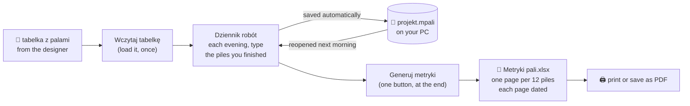
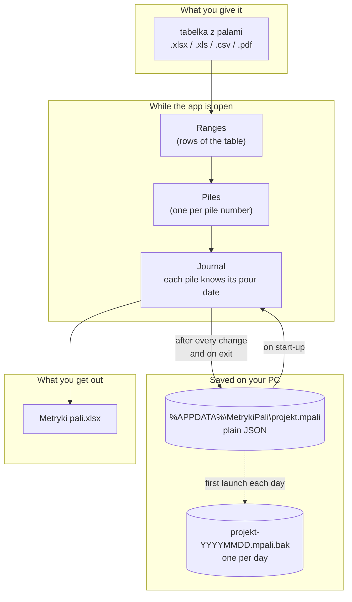
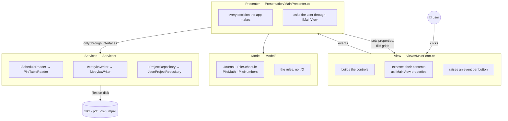

# Metryki pali — generator

Turns a pile schedule (**tabelka z palami**) into printable as-built pile records
(**metryki pali**), grouped by the day each pile was actually poured.

```
tabelka z palami.xlsx   →   [ app ]   →   Metryki pali.xlsx   →   print / PDF
   93 rows of ranges                      81 pages, 12 piles each
```

It is a Windows desktop app. It runs offline, needs no installation, no internet,
no database and no account.

---

## 1. What it does, in plain words

A designer gives you a table that says things like *"piles 1 to 10 are 0.4 m
across and 7 m deep"*. The paperwork you must hand back is completely different:
one sheet per twelve piles, each sheet stamped with the date those twelve piles
were concreted, each pile listed with its length and how much concrete went in.

Typing that by hand for a thousand piles takes days. This app does it in seconds.

The part that cannot be automated is knowing **which piles you did on which
day** — only the person on site knows that. So the app keeps a **work journal**:
every evening you type in the piles you finished, and it remembers. At the end of
the job you press one button and get the whole set of metryki.



You can close the app, shut the computer down, and come back a week later. The
journal is still there.

---

## 2. How to run it

### The easy way — one file, no installation

```powershell
powershell -ExecutionPolicy Bypass -File publish.ps1
```

This produces **`publish\MetrykiPali.exe`** (about 51 MB). Copy that one file
onto any Windows 10 or 11 machine and double-click it. Nothing else is needed —
not even .NET.

### From source — for developers

Requires the .NET 10 SDK.

```powershell
dotnet run --project src\MetrykiPali     # start the app
dotnet test                              # run the 159 tests
dotnet build                             # just compile
```

---

## 3. How to use it

### Step 1 — load the schedule (once per site)

Press **Wczytaj tabelkę...** and pick the file. Accepted: `.xlsx`, `.xls`,
`.csv`, `.pdf`. The columns must be in this order:

| numer od | numer do | średnica [m] | długość pala [m] | zbrojenie |
|---|---|---|---|---|
| 1 | 10 | 0.4 | 7 | Brak |
| 11 | 28 | 0.4 | 8 | Brak |

Title lines, blank rows, notes and totals are skipped automatically. Both `0.4`
and `0,4` are understood.

The app expands the ranges into individual piles — `1–10` becomes ten piles — and
works out the concrete for each.

### Step 2 — check the header

**Budowa**, **Wykonawca**, **Metoda**, **Betoniarnia** are printed on every page.
They come pre-filled; correct them once and they are remembered.

### Step 3 — log each day's work

This is the part you repeat. Set the date, type the piles, press Enter:

```
Data wykonania: 13.09.2022     Pale: 11-16, 63-66, 77-84
```

Write ranges and single numbers separated by commas, semicolons or spaces —
`1-10, 25, 30-33`. You can also tick rows on the **Pale** tab and press
**Dodaj zaznaczone z listy pali**.

The **Dziennik (dni)** tab then shows one line per day:

| Data | Pale | Ilość | Beton [m³] | Stron |
|---|---|---|---|---|
| 12.09.2022 | 1-10, 17-18 | 12 | 14.02 | 1 |
| 13.09.2022 | 11-16, 63-66, 77-84 | 18 | 24.18 | 2 |

Close the app whenever you like. Tomorrow it opens exactly as you left it.

If you type a pile you already logged on a different day, the app asks whether
you meant to **move** it — it never ends up on two days at once.

### Step 4 — correct anything that differs from the design

On the **Pale** tab, **Dł. wykonana** starts equal to the design length. If a
pile actually went deeper, type the real figure; its concrete volume recalculates
straight away.

### Step 5 — generate

Press **Generuj metryki (.xlsx)** and choose where to save. Every day in the
journal is written in one go. Then **Otwórz wygenerowany plik** to check it, and
print from Excel or *Save as PDF*.

Piles with no date yet are **not** included — the app tells you how many are
still outstanding and asks before continuing.

---

## 4. How the data is managed

Everything lives in files on your own computer. Nothing is sent anywhere.



**Where the journal is kept**

```
%APPDATA%\MetrykiPali\projekt.mpali
```

which is usually `C:\Users\<you>\AppData\Roaming\MetrykiPali\`. Use
**Projekt → Pokaż folder z danymi** to open it.

**What is in it** — plain readable JSON: the site details, the ranges from the
schedule, and every pile with its lengths and its pour date. You can open it in
Notepad. You can copy it to another machine. You can back it up like any file.

**How it is protected**

- Saved after **every** change and again when you close the window — there is no
  "save" button to forget.
- Written to a temporary file first, then moved into place. If the machine dies
  mid-save, the previous journal is still intact rather than half-written.
- One dated backup is kept the first time you open the app each day.
- If the file is ever damaged, the app starts empty instead of refusing to open.

**More than one site at a time** — use **Projekt → Zapisz jako...** to keep a
separate `.mpali` file per site, and **Projekt → Otwórz...** to switch. Starting
a new project never touches the file you saved a site to.

**Reloading a corrected schedule keeps the journal.** If the designer reissues
the table, load it again: pour dates are matched back onto the new piles by
number. Weeks of site records are not lost to a re-import.

---

## 5. How the concrete volume is worked out

```
V = π/4 · D² · L · k
```

`k` is the overbreak coefficient — the field **Wsp. betonu**, default **1.30**.
It accounts for concrete filling more than the theoretical bore.

`k = 1.30` reproduces the figures in the reference documentation for a 0.4 m CFA
pile:

| L [m] | 6 | 7 | 8 | 9 | 10 | 11 | 12 |
|---|---|---|---|---|---|---|---|
| computed [m³] | 0.98 | 1.14 | 1.31 | 1.47 | 1.63 | 1.80 | 1.96 |

⚠️ In the real records the ratio drifts between about **1.18 and 1.46** from day
to day, because those are *measured* quantities, not calculated ones. 1.30 is a
sensible default, not ground truth. Change **Wsp. betonu** to match a particular
pour — every volume recalculates immediately.

---

## 6. How the code is organised

The app follows **MVP (Model–View–Presenter)**, the standard arrangement for
Windows Forms — the desktop equivalent of MVC on the web, and the sibling of MVVM
in WPF. It is used here in its **Passive View** form: the window contains no
decisions at all.



**Why it is worth the extra files**

| Layer | Knows about | Can be tested without |
|---|---|---|
| **View** (`MainForm`) | buttons, grids, dialogs | — it is the only part not unit-tested |
| **Presenter** (`MainPresenter`) | what should happen when | a window, a disk |
| **Model** (`Journal`, `PileMath`, …) | pile rules and arithmetic | anything at all |
| **Services** | files, Excel, JSON | — the real ones are tested against fixtures |

The presenter never mentions a `Button`, a `MessageBox` or a file path it made up
itself; it asks `IMainView`. That single rule is what lets the test suite press
every button in the app and read every message back without a window ever
opening — see `MainPresenterTests` and `Fakes.cs`.

`Program.cs` is the **composition root**: the one place that decides which real
implementations get used. The tests substitute fakes there and nothing else
changes.

The domain is deliberately small and pure. `Journal` is the heart of it: it owns
the rule that a pile's pour date lives on the pile itself, so there is never a
second list to fall out of step. It also splits "what would happen" (`Plan`) from
"do it" (`Apply`), which is why the app can ask *"these piles already have a
different date — move them?"* before anything changes.

### Project layout

```
src/MetrykiPali/
  Program.cs                  composition root — wires everything together
  Model/
    Types.cs                  Pile, PileRange, WorkDay, MetrykaSettings, ProjectState
    Journal.cs                which piles were poured on which day
    PileMath.cs               the volume formula + expanding ranges into piles
    PileNumbers.cs            parses and formats "1-10, 25, 30-33"
  Services/
    Interfaces.cs             IScheduleReader, IMetrykaWriter, IProjectRepository
    PileTableReader.cs        reads .xlsx / .xls / .csv / .pdf
    MetrykaWriter.cs          writes the paginated METRYKA PALI workbook
    JsonProjectRepository.cs  saves and restores the journal
  Presentation/
    IMainView.cs              what the presenter may ask the window for
    MainPresenter.cs          all of the behaviour
  Views/
    MainForm.cs               the window — controls and events only
tests/MetrykiPali.Tests/
  fixtures/                   sample schedules in every supported format
publish.ps1                   builds the standalone offline .exe
```

---

## 7. Tests

```powershell
dotnet test
```

**159 tests**, about two seconds, no window and no network.

| Suite | What it covers |
|---|---|
| `MainPresenterTests` | the whole app driven through a fake window: loading, logging days, moving piles, generating, saving, every error path |
| `JournalTests` | plan-then-apply, moving a pile between days, removing a day, per-day totals |
| `PileNumbersTests` | `1-10, 25, 30-33`, mixed separators, en/em dashes, dedup, round-trip; junk rejected with the bad fragment named |
| `PileMathTests` | the formula, every length in the reference table, half-away-from-zero rounding |
| `PileTableReaderTests` | csv/xlsx/pdf, comma *and* dot decimals, junk skipped, a file locked by Excel, unsupported types |
| `PaginationTests` | days never share a page, an 18-pile day splits 12 + 6, date ordering |
| `MetrykaWriterTests` | the produced workbook read back: label rows, 48-row blocks, per-page dates, page breaks, A4 fit-to-width, borders, an 80-page run |
| `ProjectStoreTests` | round-trip, pour dates and corrected lengths, Polish characters, missing/corrupt files, daily backup |
| `WorkflowTests` | three site days across two restarts, then one generation |

Test inputs are in [tests/MetrykiPali.Tests/fixtures/](tests/MetrykiPali.Tests/fixtures/)
and double as sample files to try the app with:

| File | Shape |
|---|---|
| `tabelka-testowa.xlsx` | 6 ranges / 60 piles, the normal case |
| `tabelka-testowa.pdf` | the same table as a PDF |
| `tabelka-podstawowa.csv` | semicolons, dot decimals, a 7.5 m length |
| `tabelka-przecinki.csv` | semicolons with **comma** decimals |
| `tabelka-angielska.csv` | commas as field separators |
| `tabelka-smieci.csv` | title lines, blank row, a note and a totals row to ignore |

Two real bugs were found by writing these: CSV files with comma decimals were
silently dropping every row, and starting a new project overwrote the file the
current site had just been saved to.

---

## 8. Sample output

[przyklad/](przyklad/) holds results generated from the real Łódź schedule:

- `Metryki pali - WYGENEROWANE.xlsx` / `.pdf` — all 969 piles, 81 pages
- `Metryki pali - dziennik 2 dni (z aplikacji).xlsx` — two logged days, produced
  through the app's own interface

---

## 9. Working on the code

Each feature gets its own branch, merged back with `--no-ff` so the history shows
what changed for which reason. Branch names, commit style and the checks to run
before merging are in **[CONTRIBUTING.md](CONTRIBUTING.md)**.

```bash
git log --graph --oneline --decorate --all     # what has changed, feature by feature
```

---

## 10. Known limits

- Output is `.xlsx`. PDF is one *Save as PDF* away in Excel, but the app does not
  write PDF directly.
- The source table's five columns must be in the order shown; there is no column
  mapping screen yet.
- **Beton z betoniarni** is one value for the whole job, not per day.
- Generating blocks the window for a second or two on a large job; there is no
  progress bar.
- The journal records *which* piles were poured on a day, not the order within it.
